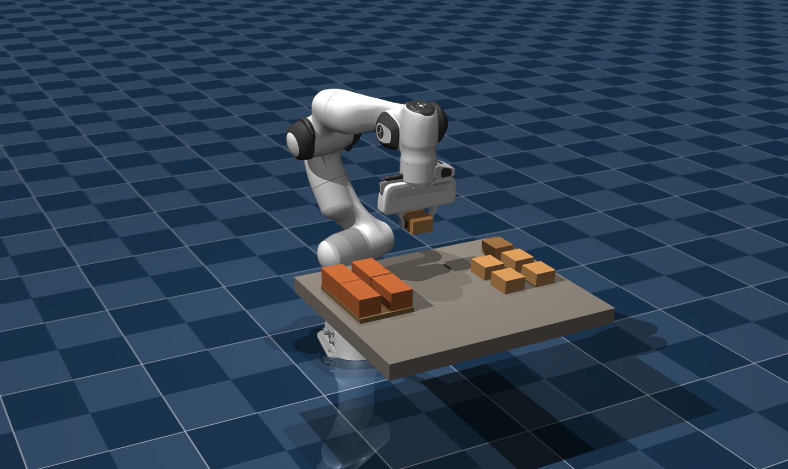
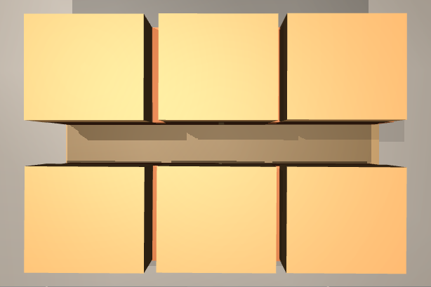
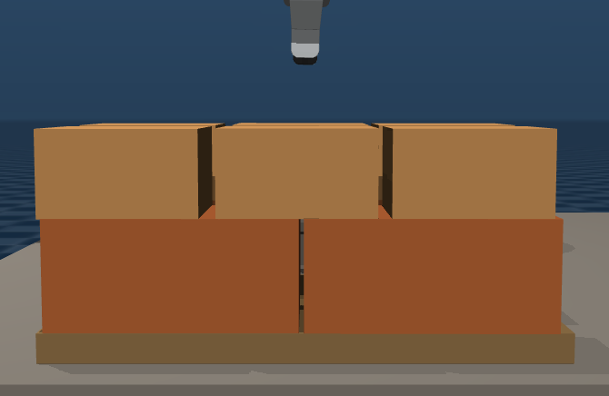

# Scripted palletizing

A robot arm picks 10 boxes off a table and stacks them on a pallet: the large ones
underneath, the medium ones on top, every layer flat. Simulated in MuJoCo with a Franka
Emika Panda.

<div align="center">
  
</div>

**None of this is decided by an algorithm.** Which box goes in which slot is written by
hand in [`configs/pallet.yaml`](configs/pallet.yaml) and the puzzle fits, like a game of
Tetris that has already been solved. There is no perception, no planner, nothing that can
get a choice wrong.

What **is** real is the physics — and therefore everything that gets measured.

## Why it exists

So that the observability platform receives **genuine** palletizing episodes from day one,
without waiting for the system that will eventually produce them.

The plan is scripted; the measurement is not. The arm really grips, the boxes really fall
and settle, and every number uploaded comes from measuring the simulator's state: the
error against the planned slot, how much of each box is supported, how far it overhangs,
where the centre of gravity ends up and with what margin the stack would survive
transport. That is what makes these episodes usable as a baseline even though the script
is a solved puzzle.

When the real pipeline arrives, it replaces the script and touches nothing else.

## Requirements

- **Python 3.12** (developed and verified on 3.12.3).
- **Linux with a working OpenGL stack.** Headless rendering uses EGL and needs a render
  node (`/dev/dri/renderD*`); `MUJOCO_GL=glx` against an X display works too. The
  simulation is headless by default — `scripts/palletize.py` sets `MUJOCO_GL=egl` itself
  whenever `--viewer` is absent.
- **`git`**, to fetch the arm model at install time.
- **The `theker_telemetry` SDK** — see the limitation below. It is a hard requirement, not
  an optional extra.
- Supabase credentials are **optional**: without them the simulation runs and writes to
  `runs/` just the same.

### The one dependency that is not in `requirements.txt`

`theker_telemetry` is imported at the top of `scripts/palletize.py`,
`src/pallet/telemetry.py`, `src/pallet/measure.py` and `tests/test_pallet.py`. **It is not
on PyPI.** It lives in the sibling [`Platform`](https://github.com/STACKSPECT/Platform)
repository under `backend/`, on its `dev` branch, and `scripts/setup.sh` installs it
editable from a local checkout.

This is a real limitation and worth stating plainly: **without that repository this one
will not start from a clean clone.** Not the simulation, not even the tests — the import
fails before anything runs. The SDK is deliberately not vendored here: it is the contract
for what the platform stores, and whoever stores the data is who defines its shape.

`setup.sh` looks for it at `../../orca/workspaces/Platform/main/backend` by default and
takes an override:

```bash
git clone --branch dev https://github.com/STACKSPECT/Platform.git ../Platform
SDK=../Platform/backend bash scripts/setup.sh
```

If it is missing, `setup.sh` warns and carries on — but the simulation will then fail at
import time.

## Installation

```bash
bash scripts/setup.sh
source .venv/bin/activate
```

`scripts/setup.sh` is idempotent and can be re-run. It creates `.venv/`, installs the
pinned `requirements.txt`, installs the telemetry SDK editable, checks that the SDK
actually carries the episode lifecycle (`RunLog.begin`), and sparse-clones the Franka
Panda model from [MuJoCo Menagerie](https://github.com/google-deepmind/mujoco_menagerie)
into `third_party/`. The model is cloned rather than committed: it is megabytes of meshes
under its own licence.

Then check the install:

```bash
python tests/test_pallet.py      # 16 checks, no simulator needed
```

## Usage

```bash
python scripts/palletize.py                      # one episode, headless, to disk
python scripts/palletize.py --viewer --speed 3   # watch it build
python scripts/palletize.py --viewer --hold      # and keep the window open at the end
python scripts/palletize.py -n 3                 # 3 episodes, headless
python scripts/palletize.py -n 3 --no-telemetry  # no upload, disk only
```

One episode takes roughly three minutes of wall clock.

### Flags

| Flag | Default | What it does |
|---|---|---|
| `-n`, `--episodes` | `1` | How many episodes to run. |
| `--seed` | `1` | Seed of the first episode; the rest follow on from it. |
| `--viewer` | off | Opens the interactive viewer. Only valid with a single episode. |
| `--hold` | off | With `--viewer`, leaves the window open at the end so you can inspect the finished pallet. The run does not terminate until you close it. |
| `--speed` | `1.0` | **Playback** rate in the viewer. Does not touch the robot. |
| `--motion-speed` | `1.0` | The arm's **real** speed, as a multiple of the value in `configs/pallet.yaml`. Above ×1 the box slips out of the gripper — the measurement table is in that file. |
| `--no-telemetry` | off | Do not upload to Supabase; write to disk only. Telemetry is **on by default** when credentials are present. |
| `--label` | `paletizado guionizado` | Name of the run in the platform's run list. |

Viewer controls: drag to rotate the camera, scroll to zoom, `ESC` to quit.

### What it produces

Every run leaves a directory under `runs/`:

```
runs/<timestamp>-pallet/
  episodes.jsonl        one JSON line per episode: the outcome and its metrics
  <seed>/003-top.png    overhead view as layer 1 closes
  <seed>/003-side.png   elevation
  <seed>/009-top.png    overhead view of the finished pallet
  <seed>/009-side.png   elevation
```

The two views below are exactly `009-top.png` and `009-side.png` from a real run, copied
into `docs/img/`.

<div align="center">
  
  
</div>

### Telemetry

**It uploads by default** when a `.env` with credentials is present (copy
[`.env.example`](.env.example)). Without one it runs just the same and writes to `runs/`,
and it says so at startup rather than keeping quiet about it:

```
telemetría: ACTIVA · /runs/<id>
telemetría: solo disco · NO hay credenciales.
```

When it is active, the run is replicated to Supabase **live**: the episode is born
in-progress and the rows go out as they are measured, so the platform's Live screen shows
the pallet building package by package instead of appearing fully stacked. The `jsonl` on
disk remains the source of truth; if the network fails, the episode does not notice.

The images **are uploaded too**, via `RunLog.snapshot()`: the PNG goes to Storage and the
row to the `snapshots` table. There is one per closed layer and one of the finished
pallet, each carrying the `after_seq` of its placement — so the photo and that point on the
centre-of-gravity trace are the same instant.

## Development

```
configs/scene.yaml       the cell: arm, table and speeds
configs/pallet.yaml      the pallet, the box catalogue and THE SCRIPT
src/cell.py              table, cameras and the grasp convention
src/control/arm.py       differential IK (mink) -> actuators
src/pallet/scene.py      scene construction and the two views
src/pallet/measure.py    measurement over the simulator's real state
src/pallet/episode.py    the manoeuvre and the episode loop
src/pallet/telemetry.py  the ONLY place that knows the platform exists
tests/test_pallet.py     16 checks, no framework and no simulator
```

Checks:

```bash
python tests/test_pallet.py      # 16 checks
python -m src.pallet.measure     # the measurement, with its own asserts
```

The tests use **no framework on purpose** — plain `assert`s run as a script. New tests
should follow that. [`CONTRIBUTING.md`](CONTRIBUTING.md) has the full workflow;
[`AGENTS.md`](AGENTS.md) carries the hard rules and the reasoning behind the values in
`configs/`, and is the thing to read before changing anything.

## Results (2026-09-19)

10 boxes, 2 layers, a 210 × 140 mm pallet (a 1:5.7 model of a Euro pallet: the Panda's
gripper opens 80 mm and a real pallet is ungraspable).

| | |
|---|---:|
| Placed | 10/10 |
| Placement error, mean · max | 2.6 mm · 5.7 mm |
| Flatness of the top layer | 0.1 mm |
| Maximum overhang | 0.2 mm |
| CoG relative to the pallet centre | 2.2 mm |
| Stability margin at the end | +58 mm |
| Pallet fill | 77 % |
| Duration | 204 s simulated |

Repeatable: the script is fixed and MuJoCo is deterministic, so the same seed gives the
same pallet on the same machine with the same pinned dependencies. That is what makes two
commits comparable.

## For the real palletizer

When the real simulation exists — with perception and a planner —
[`docs/INTEGRACION.md`](docs/INTEGRACION.md) explains how to plug it into the platform the
same way this one is: the five calls, the only thing that changes, the five traps and how
to check it. (That document is in Spanish.)

## Dependencies

Everything is pinned in [`requirements.txt`](requirements.txt). The licences below were
audited with `pip-licenses` against the resolved environment, not taken from memory.

| Package | Version | Licence |
|---|---|---|
| [mujoco](https://github.com/google-deepmind/mujoco) | 3.13.0 | Apache-2.0 |
| [mink](https://kevinzakka.github.io/mink/) | 1.3.0 | Apache-2.0 |
| [qpsolvers](https://github.com/qpsolvers/qpsolvers) | 4.13.0 | **LGPL-3.0** |
| [daqp](https://github.com/darnstrom/daqp) | 0.9.1 | MIT |
| [numpy](https://numpy.org) | 2.4.4 | BSD-3-Clause |
| [scipy](https://scipy.org/) | 1.18.1 | BSD-3-Clause |
| [PyYAML](https://pyyaml.org/) | 6.0.3 | MIT |
| [imageio](https://github.com/imageio/imageio) | 2.37.3 | BSD-2-Clause |

Pulled in transitively: `absl-py` (Apache-2.0), `etils` (Apache-2.0), `fsspec`
(BSD-3-Clause), `glfw` (MIT), `pillow` (MIT-CMU), `PyOpenGL` (BSD), `typing_extensions`
(PSF-2.0), `zipp` (MIT).

`qpsolvers` and `daqp` are listed explicitly because mink solves the IK with `qpsolvers`
and ships **no solver backend of its own**: without one, `solve_ik` blows up at runtime.

### A note on the LGPL dependency

`qpsolvers` is **LGPL-3.0**, the only copyleft licence in the tree. It is used as an
unmodified library, installed from PyPI by `pip`, and no part of it is copied into or
redistributed by this repository. That is the case the LGPL explicitly allows, so it does
not oblige this project to change its own licence. Anyone redistributing a **bundled**
artefact of this project (a container image, a frozen executable) does take on the LGPL's
obligations for that bundle, and should keep `qpsolvers` replaceable.

### Not redistributed here

- **[MuJoCo Menagerie](https://github.com/google-deepmind/mujoco_menagerie)** — the Franka
  Emika Panda model, cloned into `third_party/` by `scripts/setup.sh` at install time and
  listed in `.gitignore`. The `franka_emika_panda` model is **Apache-2.0**; Menagerie
  licenses per directory, so check the model's own `LICENSE` rather than assuming. Nothing
  of it is committed here.
- **`theker_telemetry`** — installed editable from the sibling `Platform` repository, as
  described above.

## Licence

MIT — see [`LICENSE`](LICENSE). Copyright (c) 2026 STACKSPECT.

## Where it comes from

The geometry, the control and the calibration come from the induction simulation of the
THEKER Robotics challenge (HackSpain '26), where they were tangled up with its perception
and its planner. Here they arrive on their own. The measured numbers justifying each value
are in the comments of `configs/pallet.yaml`, which is where to look before touching
anything: four of them were hard-won and cannot be tuned by eye. Those config comments and
`AGENTS.md` are in Spanish, as is the code's commentary.
